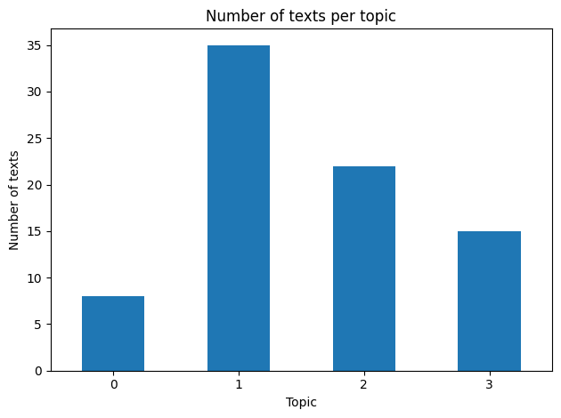
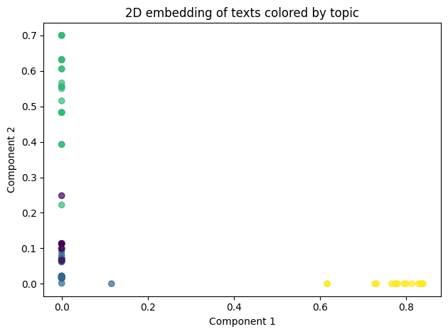

# Genomic Text Curation & Topic Grouping

This project builds a small NLP pipeline on top of 80 rows from the ADVP curated variant table. It:

1. Extracts structured information (variants, genes, phenotypes, simple relations) from short text snippets.  
2. Groups texts into high-level topics using document clustering.  
3. Produces outputs that a human curator can easily inspect.

## 1. Setup and How to Run

**Environment**

- Google Colab (recommended) or local Jupyter Notebook  
- Python 3  
- Libraries: `pandas`, `scikit-learn`, `matplotlib`, `ipywidgets`

**Steps (Colab)**

1. Open `exploration.ipynb` in Google Colab.  
2. When prompted, upload `advp.variant.records.hg38.tsv`.  
3. Run all cells from top to bottom.  

Running the notebook will:

- Read the TSV file and keep the first 80 rows.  
- Build a combined text field per row.  
- Extract entities and write `entities_relations.json`.  
- Perform topic modeling and print topic summaries.  
- Show a small interactive “curator view”.  
- Save a sample file for error analysis.

## 2. Methods Overview

### 2.1 Data Preparation

- Input: `advp.variant.records.hg38.tsv` (ADVP variant records).  
- We keep the first 80 records for a small, lightweight demo.  
- For each row, we create a `text` field by joining:
  - `Top SNP` (variant ID)  
  - `nearest_gene_symb` (gene symbol)  
  - `Phenotype`  
  - `Phenotype-derived`  

### 2.2 Entity Extraction (Regex Rules)

We apply simple regular expressions to each text:

- **Variants** – detect IDs like rs12345.  
- **Genes (candidates)** – detect uppercase tokens of length 3–10 (e.g., TMEM59).  
- **Disease phrases** – detect capitalized multi-word phrases (e.g., "Episodic Memory Performance").

### 2.3 Curated Entities and Relations

We build a small curated schema for each row. 
- A unique `text_id` (e.g., `T0001`).  
- `variant` from `Top SNP`.  
- `gene` from `nearest_gene_symb`, normalized to uppercase.  
- `phenotype` from `Phenotype`, with a few common abbreviations expanded, such as:
  - `AD` to “Alzheimer’s disease”  
  - `ADRD` to “Alzheimer’s disease and related dementias”  
- `relation` is set to `"associated_with"` for all rows, reflecting that the dataset reports variant–phenotype associations.  
- `evidence_span` is the combined `text` so a curator can see the original snippet.

This schema is exported as `entities_relations.json`

## 3. Topics and Clustering

### 3.1 Document Representation

We convert each "text" into a TF–IDF vector. English stopwords are removed. The vocabulary is capped at 500 terms to keep the model simple and reduce noise, which is reasonable for only 80 documents.

### 3.2 Choosing the Number of Topics

We run k-means clustering for different numbers of clusters (from 2 to 9) and record the k-means inertia (how spread out the points are inside each cluster). The inertia curve bends around k = 4: it drops a lot between 2 and 4, and improves only slightly after 4. We therefore choose 4 clusters as a good balance between simplicity and cluster quality.

### 3.3 Topic Inspection

With 4 clusters, we:

- Assign each document a topic label (0–3).  
- For each topic, we list:
  - The top keywords (based on the cluster center in TF–IDF space).  
  - Three example texts from that topic.

## 4. Visualizations

The notebook produces two main plots:

1. **Bar chart of topic sizes**  
   - X-axis: topic ID (0–3).  
   - Y-axis: number of texts in each topic.  
   - Purpose: show how many documents fall into each topic.

2. **2D scatter plot of documents colored by topic**  
   - We reduce the TF–IDF vectors to two components using TruncatedSVD.  
   - Each point is one document, colored by its topic label.  
   - One topic is clearly separated along the first component, while the others overlap more.  
   - Some overlap in 2D is expected, because we compress many original dimensions into just two.

## 5. Mini “Curator View” (Bonus)

The notebook includes a small interactive view using widgets:

- You can filter the curated table by:
  - Gene (substring match).  
  - Variant (substring match).  
  - Topic ID.  
- It shows up to 20 matching rows at a time.

## 6. Error Analysis (Bonus)

We sample 40 rows into 'error_analysis_sample.csv' to inspect how well the regex extraction works. From this sample we see:

- **False positives**:
  - Some tokens in the 'genes' list are not real genes (they do not match the 'nearest_gene_symb' column).  
  - Disease-like codes such as 'AD', 'PD', 'ADRD', 'LOAD', 'HDL', 'CSF' and brain-region codes such as 'BA9', 'BA44' are sometimes mis-labeled as genes.

- **False negatives**:
  - Some rows have 'Phenotype' or 'Phenotype-derived' filled but 'disease_phrases' is empty, often because the disease is written as an abbreviation or in a hyphenated phrase (for example, “High-density lipoprotein (HDL …)”) that the simple pattern does not match.

## 7. Limitations and Future Work

**Current limitations**

Entity extraction is based on simple regex rules and can mislabel abbreviations and codes; All relations are collapsed to a single type ("associated_with"); Topics are learned from only 80 records; with more data, topics may shift; No external biomedical knowledge (such as gene or disease ontologies) is used.

**Possible next steps**

Use a biomedical NER model to improve gene and disease detection; Add dependency-based relation extraction to distinguish different types of effects; Turn the curator view into a small web app for easier manual review.